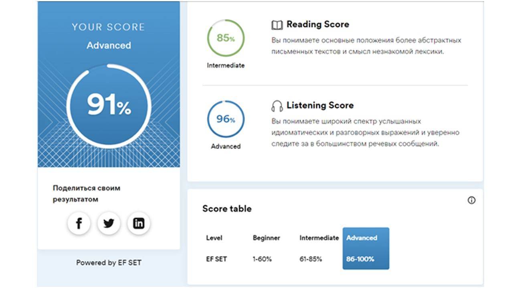

# __Dmitry Melnik__
___
## __Contacts:__
* __Location__: Kharkiv, Ukraine
* __Phone__: +38(099)509 81 68
* __Email__: mitya.melnik89@gmail.com
* __GitHub__: [Mitya89](https://github.com/Mitya89)
___
## __About me:__
I work in area of wastewater treatment as process engineer, but IT-industry is also very interesting to me. That is why I decided to get new knowledge and to expand my skills in area of Javascript frontend development.
I like the movie «The Pursuit of Happiness» . There is a phrase in it, said by the main character, which corresponds to my attitude to work, and not only to it:
«I am the type of a person that if you ask me a question and I do not know the answer, I am gonna tell you that I do not know. But I bet you what, I know how to find the answer and I will find it».
___
## __Skills:__
* HTML5/CSS3
* JavaScript Basics
* Git/GitHub
* VS Code
___
## __Code example:__
___Task___: *Raiser to the degree. Create a flow that will output to console.log() the result of exponentiation of two variables. Variables can be of any type, but we will raise only numbers of type number or string, which contain a number. Otherwise, console.log() should report a mismatched data type.*
___Code___:
```javascript
const firstItem = '5';
const secondItem = 5;
let exponent = firstItem ** secondItem;

if (
     typeof(firstItem) === "string" || typeof(firstItem) === "number" 
     && typeof(secondItem) === "number" || typeof(secondItem) === "string"
     && (exponent === exponent)
) {
     console.log(exponent);
} else {
     console.log("Несоответствующий тип данных");
}
```
___
## __Experience:__
___
## __Education:__
* __University__: Kharkiv National University of Urban Economy, major
* __Courses__:
     * Fundamentals of software testing on the [QATestLab](https://en.training.qatestlab.com/) (completed)
     * RS Schools Course "JavaScript/Front-end. Stage 0"(in progress)
___
## __Languages:__
* English - Intermediate/Advanced - according to the online-test at [www.efset.org](https://www.efset.org/)


* Ukrainian - Native
* Russian - Native